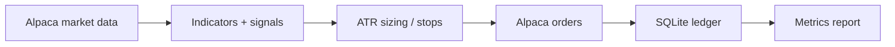

# tradingbottest

Alpaca paper-trading bot for US equities and crypto — signal scoring, ATR risk controls, SQLite ledger, performance report.

[](https://www.python.org/downloads/)
[](https://app.alpaca.markets/paper/dashboard/overview)
[](tests/test_metrics.py)

> **Paper by default.** Live trading is opt-in and risks real money.

## Table of contents

- [Features](#features)
- [Quick start](#quick-start)
- [Usage](#usage)
- [Configuration](#configuration)
- [Architecture](#architecture)
- [Design decisions](#design-decisions)
- [Core concepts](#core-concepts)
- [Project layout](#project-layout)
- [Troubleshooting](#troubleshooting)
- [Limitations](#limitations)

## Features

| Area | What it does |
| --- | --- |
| Markets | Curated liquid watchlist (full scan each loop) + BTC/ETH |
| Signals | RSI, MACD, SMA, volume — long + short stock setups |
| Risk | ATR stops / trailing (above shorts), size from stop distance, daily caps |
| Execution | Long BUY / short SELL; cover with BUY; crypto long-only |
| Storage | SQLite trades + event log under `trading_data/` |
| Metrics | Sharpe, Sortino, drawdown, win rate (`scripts/report.py`) |
| Replay | Historical bar backtest (`backtest.py`) |

## Quick start

**Requirements:** Python 3.10+, free [Alpaca](https://alpaca.markets/) paper account.

### 1. Clone and install

```bash
git clone https://github.com/<your-user>/tradingbottest.git
cd tradingbottest

python3 -m venv .venv
source .venv/bin/activate          # Windows: .venv\Scripts\activate
pip install -r requirements.txt
```

### 2. Add paper API keys

Create keys in the [Paper Trading dashboard](https://app.alpaca.markets/paper/dashboard/overview) (keys usually start with `PK`).

```bash
cp .env.example .env
```

Edit `.env` (use double quotes):

```env
ALPACA_API_KEY="your_paper_key_here"
ALPACA_SECRET_KEY="your_paper_secret_here"
```

Do not commit `.env` or share your keys.

### 3. Run (paper)

`config.yaml` already sets `paper_trading: true`.

```bash
python main.py
```

Expected startup logs:

```text
Using PAPER TRADING mode
Connected to Alpaca successfully
Buying power: $...
TRADING BOT INITIALIZED
STARTING TRADING BOT
```

Stop with `Ctrl+C`.

Symbols and risk knobs load from `config.yaml` at startup — restart the bot after editing that file.

## Usage

| Command | Purpose |
| --- | --- |
| `python main.py` | Run the live/paper loop |
| `python scripts/report.py` | Print metrics + write `trading_data/metrics_snapshot.json` |
| `python scripts/report.py --no-alpaca` | Ledger-only report (no API) |
| `python backtest.py` | Replay strategy on historical bars |
| `pytest tests/test_metrics.py -v` | Unit tests for Sharpe / Sortino / drawdown |

## Configuration

### Environment variables

| Variable | Required | Description |
| --- | --- | --- |
| `ALPACA_API_KEY` | Yes | Alpaca key id |
| `ALPACA_SECRET_KEY` | Yes | Alpaca secret |
| `ALPACA_PAPER_TRADING` | No | Overrides `config.yaml` (`true` / `false`) |
| `TRADING_CONFIG` | No | Path to YAML (default: `config.yaml`) |
| `TRADING_DATA_DIR` | No | Data directory (default: `trading_data`) |

### `config.yaml`

| Key | Purpose |
| --- | --- |
| `symbols.stocks` | Ticker list, `watchlist`, `top_N`, or `all` |
| `symbols.scan_batch_size` | Max stocks per loop (keep ≥ watchlist size for full coverage) |
| `symbols.crypto` | Crypto pairs |
| `risk.*` | Position size, daily limits, max positions, `allow_shorting` |
| `strategy.*` | Signal thresholds, ATR multiples, cooldowns |
| `paper_trading` | `true` = paper API; `false` = live (real money) |

**Live mode:** set `paper_trading: false` in `config.yaml` *or* `ALPACA_PAPER_TRADING=false`, and use **live** API keys.

## Architecture



Stack: Python 3.10+, `requests` (Alpaca REST, no official SDK), `pandas` / `numpy`, `PyYAML`, `python-dotenv`, SQLite, `pytest`.

## Design decisions

### Alpaca IEX bars instead of Yahoo (or SIP)
**What I chose:** Live prices and bars come from Alpaca’s market-data REST endpoints with `feed=iex` for equities (`tradingbot/broker.py`). Crypto uses Alpaca’s crypto trade/bars APIs.
**Why:** An earlier loop pulled history via Yahoo/`yfinance` every scan. That was slow, rate-limited, and lagged the same venue that fills orders. Alpaca data keeps signals and execution on one broker; IEX is the free/paper-friendly equity feed.
**Trade-off:** IEX is not full SIP depth or NBBO completeness — some prints and names will look different than a paid consolidated feed. Switching feeds is a params change, but live accounts may need a SIP entitlement.

### In-process TTL cache + full watchlist scans
**What I chose:** A small `_TTLCache` on bars/prices/account/positions (`broker.py`). Default universe is a curated priority watchlist (`stocks: watchlist`) scanned **every** loop when it fits under `scan_batch_size`. Multi-symbol bar requests use 50-symbol chunks.
**Why:** A rotating `top_500` book sorted A→Z among equal scores spent loops on obscure tickers. Caching + a ≤100-name watchlist gets NVDA/AAPL/etc. every cycle without hammering Alpaca; rotation only kicks in for huge `top_N` / `all` books.
**Trade-off:** Cached closes can be up to ~`bars_ttl_seconds` stale. You only trade names on the watchlist unless you enlarge it or opt into `top_N`. Single-process cache — not shared across replicas.

### ATR stops and size-from-risk, not fixed %
**What I chose:** Stops are `atr_stop_mult × ATR` below longs / above shorts (`strategy._atr_stop`); position size is `buying_power × risk_per_trade / |entry − stop|` with daily and max-notional caps (`bot.calculate_position_size`). Trailing uses the same ATR once price has moved `trail_arm_atr_mult` in favor.
**Why:** Fixed 2–3% stops treat quiet and volatile names the same. ATR ties stop distance (and therefore share count) to recent range so risk per trade is closer to a constant dollar/R target across the book.
**Trade-off:** ATR is lagging and can widen in chaos, so size shrinks when you might most want conviction sizing — or you skip trades when stop distance is huge. There is no portfolio-level vol targeting or correlation haircut beyond `max_positions`.

### Score + “strong signal” gate instead of single-indicator or full AND
**What I chose:** Entries accumulate weighted points (RSI / MACD / SMA / volume) and only fire when `buy_score_min` is met **and** at least one “strong” event fired (oversold/overbought, MACD cross, or SMA cross) — see `SignalStrategy.should_buy` / `should_short`. Soft confirmations alone never open a trade.
**Why:** Pure single-indicator entries churned; requiring every indicator at once almost never fired. Scoring with a mandatory strong leg was the middle path after tightening junk-trade filters (also: skip longs below SMA-20 unless RSI is actually oversold).
**Trade-off:** Weights and thresholds are hand-tuned, not fit out-of-sample. Interviewers should ask how you’d validate them — the repo’s answer today is paper + `backtest.py`, not a walk-forward optimizer.

### Dual market rules: session-gated stocks vs 24/7 crypto fills
**What I chose:** Equities only open/close when Alpaca’s clock says the session is open (`market_hours.py` / bot guards), with `time_in_force=day` and integer `qty`. Crypto is always “open,” uses `gtc` + **notional** market orders, then `wait_for_order_fill` to rewrite `order.quantity` from `filled_qty` (`broker.place_order`).
**Why:** US cash equities and Alpaca spot crypto are different products — hours, order semantics, and fractional sizing don’t share one path. Notional + fill reconcile exists because crypto size isn’t a clean share count up front.
**Trade-off:** Stock path does not wait on fills the same way (assumes day-market qty fills cleanly). Crypto shorts are disabled. Holiday fallback without Alpaca calendar is a short local holiday list, not a full exchange calendar.

### SQLite ledger with Alpaca as position source of truth
**What I chose:** Trades, bot counters, and trail events live in local SQLite (`tradingbot/memory.py`, including a one-shot JSON→SQLite migrate). On startup, `_restore_state` intersects open ledger rows with live Alpaca positions; missing broker positions are closed as ghosts at flat P&L.
**Why:** A file/JSON store was enough until fields and events grew; SQLite keeps a queryable history for `scripts/report.py` without standing up Postgres. The broker still owns what you actually hold — the ledger must not invent positions after a crash or manual flat.
**Trade-off:** Single-writer, local-disk, not multi-instance safe (`check_same_thread=False` is a convenience, not a concurrency model). Ghost closes at `pnl=0` can hide real P&L if you flattened outside the bot. Metrics blend this ledger with Alpaca portfolio history when available.

## Core concepts

- **Session model:** Stocks trade only in the regular US equity session (Alpaca clock, local/holiday fallback). Crypto is treated as always open.
- **Risk unit:** Size so that a full stop ≈ a fixed fraction of buying power (`risk.*_per_trade`). Ledger stores `initial_risk` / `r_multiple` for post-trade review.
- **Universe:** Default is a curated priority watchlist (`stocks: watchlist` / `tradingbot/universe.py`), scanned every loop. `top_N` is priority-biased (not market cap); only rotates when larger than `scan_batch_size`.
- **Metrics:** Risk-free rate `0%`; annualize equity √252, crypto √365, blended √365 (`metrics.py`). Sharpe/Sortino are marked unreliable until ≥30 calendar days and ≥21 daily return observations.

## Project layout

```text
tradingbottest/
├── main.py                 # entrypoint
├── backtest.py             # historical replay CLI
├── config.yaml             # symbols + risk + strategy
├── requirements.txt
├── .env.example
├── tradingbot/             # package
│   ├── bot.py              # TradingBot loop
│   ├── broker.py           # Alpaca REST + cache
│   ├── strategy.py         # SignalStrategy + ATR stops
│   ├── universe.py         # priority watchlist
│   ├── indicators.py
│   ├── market_hours.py
│   ├── memory.py           # SQLite
│   ├── metrics.py
│   ├── models.py
│   ├── config.py
│   ├── backtest.py
│   └── env.py
├── scripts/
│   └── report.py
└── tests/
    └── test_metrics.py
```

`trading_data/` is created at runtime and gitignored.

## Troubleshooting

| Symptom | Fix |
| --- | --- |
| `Missing API keys!` | Fill `.env`, run from repo root |
| `401 unauthorized` | New paper keys; keep values in double quotes |
| `Failed to connect to Alpaca API` | Wrong keys, or live keys with paper mode on |
| `ModuleNotFoundError` | Activate venv, then `pip install -r requirements.txt` |
| YAML ticker becomes `True` | Quote booleans like `"ON"` in `config.yaml` |
| Metrics all `n/a` | No closed trades yet — expected early on |

## Limitations

- No published performance numbers until paper trades accumulate (`scripts/report.py`)
- Equity long + short (easy-to-borrow); crypto long-only; no portfolio optimizer
- Stock bars use Alpaca `feed=iex` (paper-friendly; SIP may need a paid data plan)
- This is experimental software — paper trade first; live trading is at your own risk
